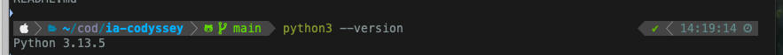
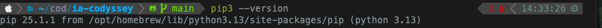
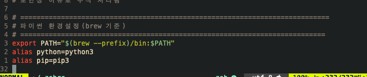
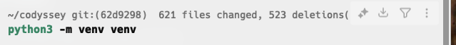
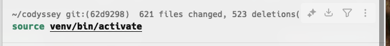
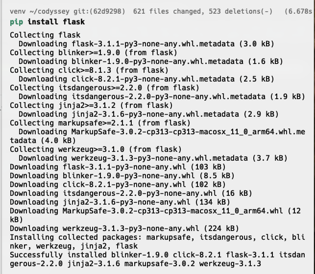
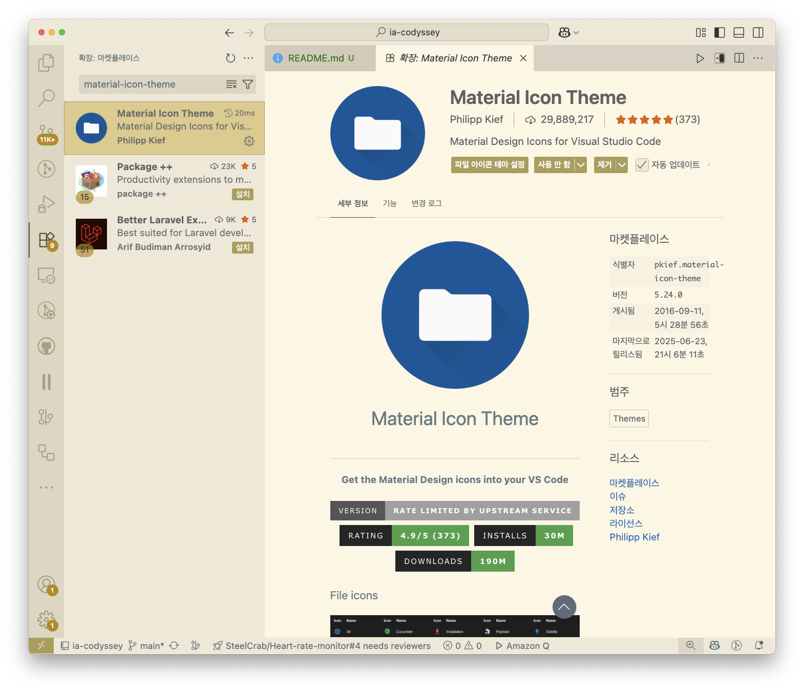
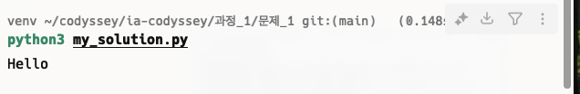

# Python 개발환경 설정 프로젝트


## 📋 수행과제

### 필수 과제
* Python을 설치한다.
* Python과 Python 패키지 관리자를 환경 변수로 등록한다.
* Python 패키지 관리자로 Flask 패키지를 설치한다.
* 터미널에서 python을 실행해서 코드로 Hello를 출력한다.
  * `"Hello"`라는 문자열을 반환하는 함수를 작성한다.
  * 함수는 반드시 `hello`라는 이름으로 작성해야 한다.
  * **파일명**은 반드시 `my_solution.py`로 지정한다.
* Visual Studio Code를 설치한다.
* Visual Studio Code의 확장 탭에서 Material Icon Theme를 설치한다.

### 보너스 과제
* Python의 대표 웹프레임워크 3가지와 특성을 Markdown 파일로 제출한다.
* 제출하는 파일이름은 `python_webframework.md`로 한다.

## 🛠 개발환경

- **터미널**: macOS/Linux 기본 터미널 사용
- **Python**: 3.8 이상
- **에디터**: Visual Studio Code 최신버전
- **패키지 관리**: pip, 가상환경(venv) 사용

## 📁 프로젝트 구조

```
ia-codyssey/
├── README.md                   # 전체 프로젝트 개요
└── 과정_1/
    └── 문제_1/
        ├── README.md           # 이 파일 (과제 상세)
        ├── .gitignore          # venv 등 제외 파일
        ├── requirements.txt    # Python 패키지 의존성
        ├── my_solution.py      # 필수과제: hello 함수
        ├── python_webframework.md  # 보너스과제: 웹프레임워크 비교
        ├── images/             # 스크린샷 및 이미지
        │   ├── python-dev-banner.png
        │   ├── python-macos-install.png
        │   ├── python-linux-install.png
        │   ├── env-variables.png
        │   ├── venv-setup.png
        │   ├── vscode-install.png
        │   ├── terminal-output.png
        │   ├── python-version.png
        │   ├── vscode-extensions.png
        │   ├── flask-install.png
        │   └── hello-output.png
        └── venv/               # 가상환경 (git 제외)
```

## 🚀 설치 및 실행 방법

### 1. Python 설치

#### macOS 환경
```bash
# Homebrew 설치 (없다면)
/bin/bash -c "$(curl -fsSL https://raw.githubusercontent.com/Homebrew/install/HEAD/install.sh)"

# Python 설치
brew install python

# 설치 확인
python3 --version
pip3 --version
```




#### Linux 환경 (Ubuntu/Debian)
```bash
# 시스템 업데이트
sudo apt update && sudo apt upgrade

# Python 설치
sudo apt install python3 python3-pip python3-venv

# 설치 확인
python3 --version
pip3 --version
```

### 2. 환경변수 설정

#### macOS (.zshrc 편집)
```bash
# .zshrc 파일 편집
vim ~/.zshrc

# 다음 내용 추가
export PATH="$(brew --prefix)/bin:$PATH"
alias python=python3
alias pip=pip3

# 변경사항 적용
source ~/.zshrc
```

#### Linux (.bashrc 편집)
```bash
# .bashrc 파일 편집
nano ~/.bashrc

# 다음 내용 추가
export PATH="$HOME/.local/bin:$PATH"
alias python=python3
alias pip=pip3

# 변경사항 적용
source ~/.bashrc
```



### 3. 저장소 클론 및 작업 디렉토리 이동
```bash
git clone <repository-url>
cd ia-codyssey/과정_1/문제_1
```

### 4. 가상환경 설정



```bash
# 가상환경 생성
python3 -m venv venv

# 가상환경 활성화
source venv/bin/activate  # macOS/Linux
```

### 5. 의존성 설치

```bash
pip install flask
```

### 6. Visual Studio Code 설치

#### macOS 환경
```bash
# Homebrew로 설치
brew install --cask visual-studio-code

# 설치 확인
code --version
```

#### Linux 환경
```bash
# 방법 1: Snap으로 설치
sudo snap install --classic code

# 방법 2: 공식 저장소 추가
wget -qO- https://packages.microsoft.com/keys/microsoft.asc | gpg --dearmor > packages.microsoft.gpg
sudo install -o root -g root -m 644 packages.microsoft.gpg /etc/apt/trusted.gpg.d/
sudo sh -c 'echo "deb [arch=amd64,arm64,armhf signed-by=/etc/apt/trusted.gpg.d/packages.microsoft.gpg] https://packages.microsoft.com/repos/code stable main" > /etc/apt/sources.list.d/vscode.list'
sudo apt update && sudo apt install code
```


#### Material Icon Theme 설치

```bash
# 명령어로 설치
code --install-extension PKief.material-icon-theme
```

### 7. 과제 실행


```bash
# hello 함수 실행
python my_solution.py
```

## 💻 개발환경 스크린샷

### Python 설치 확인


### VS Code 확장 프로그램


### Flask 설치 확인


### 실행 결과

## 📝 제출 파일

1. **my_solution.py** - hello 함수 구현
2. **python_webframework.md** - 웹프레임워크 비교
3. **requirements.txt** - 패키지 의존성

## 🔧 문제 해결 (Mac, linux)

### 가상환경 오류 시
```bash
rm -rf venv
python3 -m venv venv
source venv/bin/activate
pip install -r requirements.txt
```

### Permission Denied 오류 시
```bash
# activate는 source와 함께 사용
source venv/bin/activate
```

### pip 설치 오류 시
```bash
# 가상환경에서 설치
source venv/bin/activate
pip install flask
```

## 📞 참고 자료

- [Python 공식 문서](https://docs.python.org/)
- [Flask 공식 문서](https://flask.palletsprojects.com/)
- [VS Code 공식 사이트](https://code.visualstudio.com/)

---

## 🎯 과제 완료 인증

### macOS 환경 완료 스크린샷

